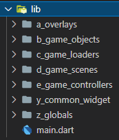
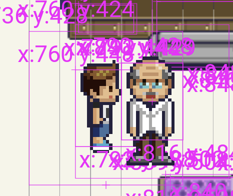

# Technical guide

## About this guide
This guide provides for the development team some information on how the project was built.

## Code repository
The source code was uploaded to Github.

You can clone the [repository](https://github.com/seriousgameOrg/seriousGame).

To have access, please contact one of our contributors :
- [antonymarques](https://github.com/antonymarques)
- [asytahFIG](https://github.com/asytahFIG)
- [Jonathan-Kung](https://github.com/Jonathan-Kung)
- [Nadirius](https://github.com/Nadirius)
- [remi-16](https://github.com/remi-16)
## External libraries
All the external libraries are displayed on the `pubspec.yaml` file.

This project uses :
- [flame](https://pub.dev/packages/flame) : Flame Engine to games developed with Flutter
- [flame_audio](https://pub.dev/packages/flame_audio) : To add audio capabilities to our game
- [flame_tiled](https://pub.dev/packages/flame_tiled) : To bridge easily the tiled library to Flame components
- [animated_text_kit](https://pub.dev/packages/animated_text_kit) : Contains a collection of some cool and awesome text animations
- [tiled](https://pub.dev/packages/tiled) : Allow Flutter to work with Tiled software
- [responsive_framework](https://pub.dev/packages/responsive_framework): Responsive Framework adapts your UI to different screen sizes
- [flame_test](https://pub.dev/packages/flame_test) : To perform Flame tests
- [test](https://pub.dev/packages/test) : To write and run tests in Dart
- [resize](https://pub.dev/packages/resize) : A Simple Responsive Design Approach

## Code architecture
All our code can be found in the lib folder. The main language used is Dart.

Each folder concerns a specific topic :
- `a_overlays` : Game, bag and params overlays
- `b_game_objects` : Characters and map objects
- `c_game_loaders` : Scene objects loader
- `d_game_scenes` : All the different game scenes
- `e_game_controllers` : Scenes, score, bag controllers
- `y_common_widget` : Reusable widgets
- `z_globals` : Dictionaries of constants

## Guide style
This project follows some style guidelines that were edicted by our team :
| Type                                        | Rules                                                   | Examples                                                     |
|---------------------------------------------|---------------------------------------------------------|--------------------------------------------------------------|
| Files naming                                | lower case with underscores                             | event_utils.dart                                             |
| Classes, enum, typeDefs, extensions naming  | Upper camel case                                        | MainScreen                                                   |
| Methods naming                              | lower camel case (start with lower case, without space) | formatDate()                                                 |
| Variables naming                            | meaningful and understandable, avoid the use of digits  |                                                              |
|  - not constant                             | lower camel case (start with lower case, without space) | String priceToDisplay = '12'                                 |
|  - constant                                 | capital letters with _ between words                    | const String DEFAULT_PRICE = '12'                            |
| Comment over a method or class              | ///+space+upper case                                    | /// Format DateTime (Calendar view) to Timestamp (Firestore) |
| Comment in a method                         | //+space+upper case                                     | // Verify the length                                         |
| String                                      | prefer using interpolation                              | 'Hello, $name! You are ${year - birth} years old.'           |
|    - " or '                                   | prefer single quote                                     | 'my string'                                                  |
| TODO                                        | //+space+TODO+(+upper case name+):+space+Upper case     | "// ignore:todo                                     // TODO: Antony - Don't forget to clean it"          |

## Team workflow
A team workflow guideline has been edicted.

### General
- 1 main branch, 1 dev branch, a branch for each contribution
- The main branch is the branch deployed for the PO = protected branch !
- The dev branch contains our progress on the implementation and is also deployed to test the US = protected branch !

### Developper workflow
- A contribution branch is used to implement new US. 1 branch per US (feature). The developer only works on a contribution branch
- A commit should be made frequently and should be working on its one ("no bug introduced") - Test the launch of the application, should still work
- Before starting to work, pull the most recent work (if you are many to work on your contribution branch)
- After 1 or 2 completed task(s), push on the repository
- MUST comment over the methods (except constructors, getter/setter, toString, equals)
- SHOULD comment the code, specially if it's necessary

### Merge request workflow
- When the US is implemented in the contribution branch, we do a Merge Request to merge on the dev branch.
- The developper who creates the Merge Request assign himself to it and assign another developper as the Reviewer.
- The reviewer analyses the changes and checkout the branch to test it on local.
- If something has to be changed,
  - If it's a minor change, do the change and approve the Merge Request
  - If it's a bigger change, mention it in Teams by message with the URL of the merge request
- If nothing has to be changed, approve and merge it.
- After performing the merge, test on the deployed website that the US is still working (could be another person)

### Best practice
- Naming the contribution branch : contrib/US8-change-the-color-background
- Push at the end of the day
- Comment your code before committing (best way to not forget it and be clean from the start)
- Commit frenquently in small granularity in order to revert some commits easily
- Create a tag after each release in order to keep a trace of the code at a particular moment

## Map creation guide
A guide concerning the map creation for Tiled is available [here](../mapCreationGuide.pdf).

## Run the app
In order to run the app, you need to use this command :
- `flutter get pub` to download the needed packages
- `flutter run -d chrome --web-renderer canvaskit` to run the app with Chrome browser

Running the application this way will display lots of rectangles boxes around objects. That's because we are in the debug mode.

For example, Mr Moutarde will have this kind of box around him because we set this kind of parameter :

